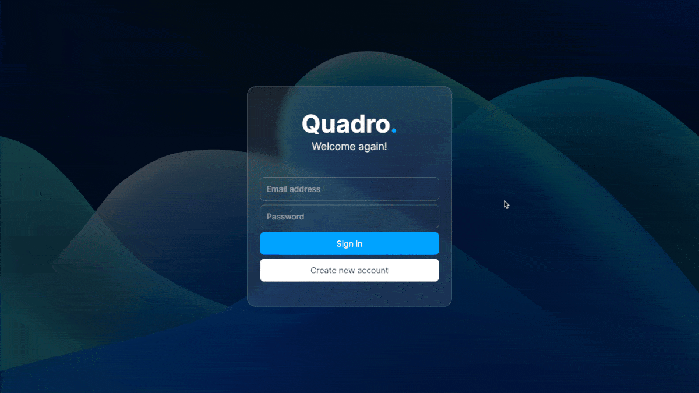

<h1 align="center">Quadro 📝</h1>

<p align="center">
  Kanban app powered by SvelteKit and PostgreSQL
</p>

<p align="center">
  <a href="https://weather.doceazedo.com">
    
  </a>
</p>

# Instructions

After cloning this repository, copy the `.env.example` file to `.env`:

```sh
cp .env.example .env
```

Then run Docker compose:

```sh
docker-compose up --build
```

The app will be available at http://localhost:3000/auth/login.
